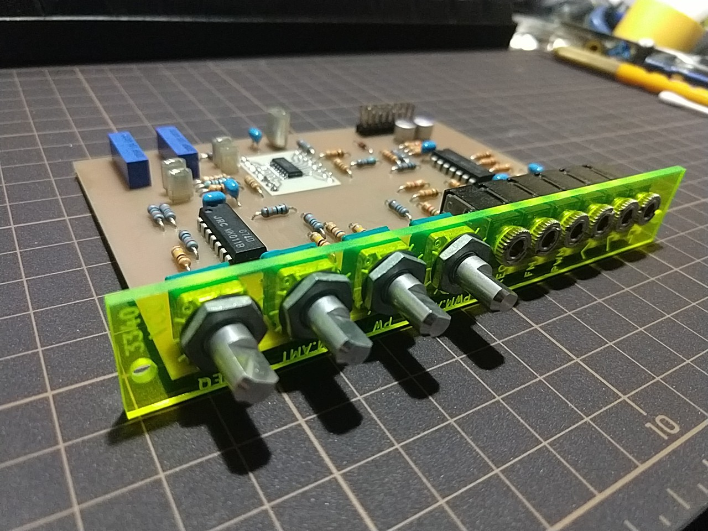

# 3340VCO
4HP Eurorack VCO module using Coolaudio V3340 (CEM3340 second-source)

### TODO
##### 回路/部品
- ~~電源入力に保護ダイオードを入れる~~
- ~~FREQ.CENTER(RV5)の1ピンと3ピンを入れ替える(時計回りで周波数大にしたい)~~
- ~~ピンヘッダをL型ボックスヘッダに変更する~~
- ~~5V正負電圧源の電流制限部(R23,R26)にLEDを入れても電圧に影響が無いか試してみる~~(却下)

##### PCB
- ~~各パッドのドリル径を0.8mmと1.0mmに統一する~~
- ~~半固定抵抗はドリル径を0.8にする~~
- ~~ランド径も統一する~~
- ~~片面->両面基板にする~~
- ~~SOP変換基板を廃止してV3340Mを基板に直接実装する~~
- ~~メインPCBの高さを115mm->110mmにする~~ -> 109.5mm
- ~~奥行きもなるべく短くする~~ -> 60mm
- ~~部品実装面を左->右に変更する(ボックスヘッダとつまみの関係でこの方が都合が良い)~~
- ~~それに伴いフロントパネルも配置を変更する~~
- 加工データ更新，基板作製，実機動作確認
